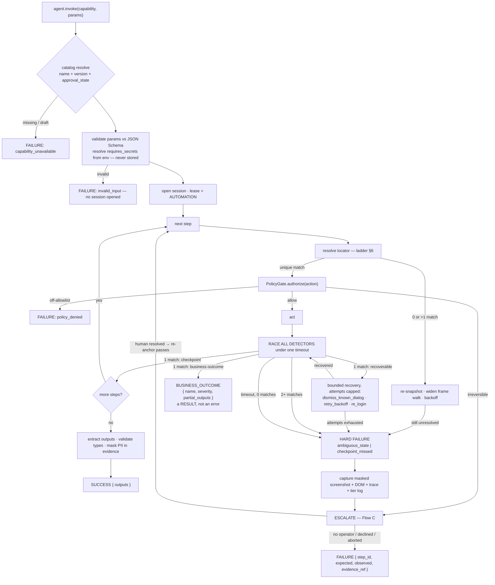
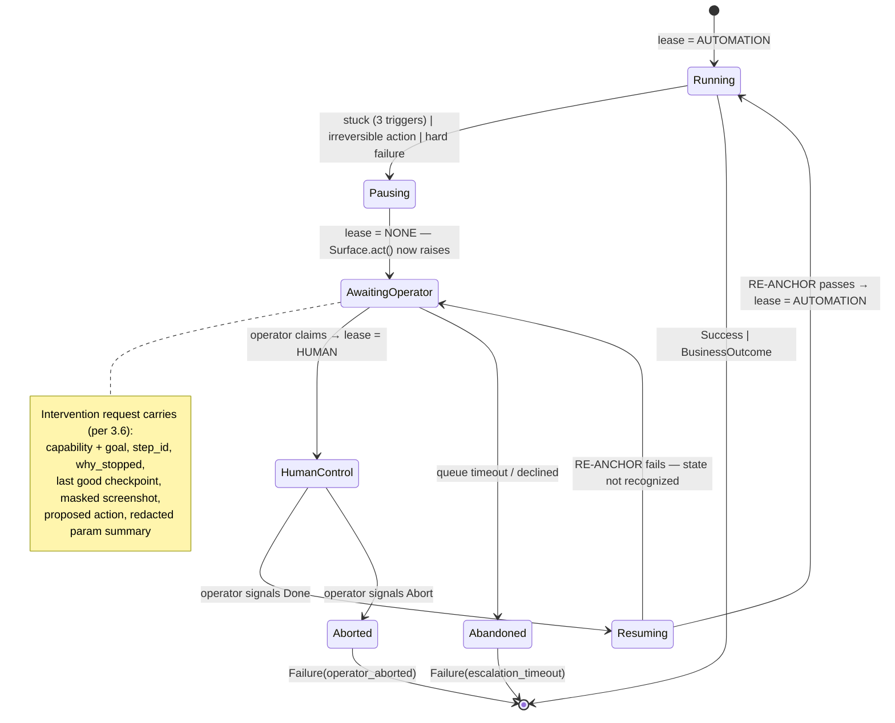

# spec.md — Computer-Use Automation System: Architecture & Flow

Internal build spec for Assignment A (interface.ai). **Not a deliverable** — §6 of the brief mandates
`/REPORT.md` at ~1–3 pages under seven exact headings; this document is the source that gets
distilled into it once code exists. Rationale lives there; this file is the picture and the contracts.

**Thesis:** *the model discovers once, a typed artifact freezes what it learned, and a deterministic
executor replays it forever — with a policy gate under every action and a human lease that can take
the wheel of the same live session.*

---

## 0. The three invariants everything protects

| # | Invariant | Enforced by |
|---|---|---|
| **I1** | The LLM never decides anything on the production path. | `ReplayEngine` has no model client injected, and `test_replay_has_no_llm` walks the import graph to prove it. Structural, not procedural. |
| **I2** | Every action passes the policy gate, and the gate sits *below* the model. | `PolicyGate` is inside `Surface.act()`, not in a prompt. A jailbroken model still cannot act off-allowlist. |
| **I3** | Exactly one holder controls a session at a time, and it is always known. | `ControlLease` on the `Session`. Drivers raise if they don't hold it. |

A fourth rule governs every ambiguous reading of the screen: **fail closed.** Two detectors matching
at once is a hard failure, never a coin flip (§5).

---

## 1. Master architecture figure

```text
                                 ┌─────────────────────────────────────────────┐
                                 │             C A L L E R S                   │
                                 ├──────────────┬───────────────┬──────────────┤
                                 │  AI agent    │  Engineer /   │    Human     │
                                 │ (production) │  CLI (record) │   operator   │
                                 └──────┬───────┴───────┬───────┴──────┬───────┘
             invoke(capability, params) │        record(goal, target)   │ claim / release
                                        v               v              v
╔════════════════════════════════════════════════════════════════════════════════════════╗
║  CONTROL PLANE                                                                         ║
║  ┌────────────────────┐   ┌──────────────────────┐   ┌──────────────────────────────┐  ║
║  │ Capability Catalog │   │   Run Orchestrator   │   │     Escalation Broker        │  ║
║  │ name → artifact @  │   │ resolves artifact,   │   │ intervention queue,          │  ║
║  │ version; exports   │──>│ opens Session, picks │──>│ context bundle, operator     │  ║
║  │ JSON Schema for    │   │ engine, owns lease,  │<──│ console (MOCK surface,       │  ║
║  │ agent tool-calling │   │ emits RunResult      │   │ real mechanism), resume      │  ║
║  └────────────────────┘   └──────────┬───────────┘   └──────────────────────────────┘  ║
╚═════════════════════════════════════════╪══════════════════════════════════════════════╝
                                          │
                 ┌────────────────────────┴────────────────────────┐
                 v                                                 v
╔══════════════════════════════════╗              ╔══════════════════════════════════════╗
║ DISCOVERY ENGINE  (LLM in loop)  ║              ║  REPLAY ENGINE      (NO LLM — I1)    ║
║  ┌────────────────────────────┐  ║              ║  ┌────────────────────────────────┐  ║
║  │ observe → decide → act     │  ║              ║  │ for step in artifact.steps:    │  ║
║  │ element digest + screenshot│  ║              ║  │   resolve locator (ladder §6)  │  ║
║  │ stuck: budget | no-progress│  ║              ║  │   act via PolicyGate           │  ║
║  │        | stuck() tool      │  ║              ║  │   RACE all detectors (§5)      │  ║
║  └────────────┬───────────────┘  ║              ║  │   classify: 1 match or fail    │  ║
║  ┌────────────v───────────────┐  ║              ║  └────────────────┬───────────────┘  ║
║  │ RECORDER                   │  ║   ARTIFACT   ║  ┌────────────────v───────────────┐  ║
║  │ verified action ->         │  ║   ────────>  ║  │ RECOVERY POLICY (bounded)      │  ║
║  │ multi-signal LocatorDesc   │  ║              ║  │ dismiss dialog · backoff ·     │  ║
║  │ + Checkpoint + generalize  │  ║              ║  │ re-login. Named, capped, never  │  ║
║  └────────────┬───────────────┘  ║              ║  │ open-ended.                    │  ║
╚═══════════════╪══════════════════╝              ╚══════════════════╪═══════════════════╝
                │                                                    │
                │        ┌───────────────────────────────────┐       │
                └───────>│      ARTIFACT STORE               │<──────┘
                         │ capabilities/<id>/<version>.json  │
                         │ git-tracked — the diff IS the     │
                         │ review mechanism. draft→approved. │
                         └───────────────────────────────────┘
                                          │
      ══════════════════════════════ POLICY GATE (I2) ══════════════════════════════
      │  allowlist(domain, route, action_type) │ reversibility class │ redactor    │
      │  deny-by-default · enforced in the driver · every action, both engines     │
      ══════════════════════════════════════╪═══════════════════════════════════════
                                            v
╔════════════════════════════════════════════════════════════════════════════════════════╗
║  SURFACE ABSTRACTION  —  the load-bearing seam                                          ║
║    snapshot() -> ElementDigest  |  locate(desc) -> Handle  |  act(Action) -> Effect     ║
║              ┌──────────────────────────┐      ┌──────────────────────────┐             ║
║              │ WebSurface               │      │ DesktopSurface   [STUB]  │             ║
║              │ Playwright · a11y-derived│      │ UIA / AX / AT-SPI would  │             ║
║              │ digest · frame walking · │      │ produce the SAME digest. │             ║
║              │ table anchors · no test  │      │ Protocol-conformant,     │             ║
║              │ IDs assumed              │      │ raises NotImplementedError│            ║
║              └──────────────────────────┘      └──────────────────────────┘             ║
║   NOTE: "legacy web" is not a separate driver. Frame walking and anchor-relative        ║
║   targeting ARE the legacy handling, and they live in the one web driver.               ║
╚═══════════════════════════════╪════════════════════════════════════════════════════════╝
                                v
                          ┌──────────────────────────────────┐
                          │  SESSION BROKER                  │
                          │  headful Chrome, --remote-       │
                          │  debugging-port, connectOverCDP  │
                          │  ControlLease{AUTOMATION|HUMAN|  │
                          │  NONE}. Survives handoff.        │
                          └──────────────┬───────────────────┘
                                         v
                          ┌───────────────────────────────────┐
                          │  MOCK CORE BANKING APP            │
                          │  frameset · table layout · no test│
                          │  IDs · login + session cookie ·   │
                          │  ?fault= injection                │
                          └───────────────────────────────────┘

  ┌──────────────────────────────────────────────────────────────────────────────────┐
  │ EVIDENCE BUS  (cross-cutting, write-through Redactor)                            │
  │ JSONL step log · masked screenshots · human_actions[] · DOM on failure ·         │
  │ policy decisions (incl. DENIED) · locator tier used   →  /evidence/<run_id>/     │
  └──────────────────────────────────────────────────────────────────────────────────┘
```

**Read the figure as three planes.** The *control plane* decides what runs and who is in control.
The *execution plane* — two engines, one gate, one surface abstraction — does the work. The
*evidence bus* is orthogonal: every plane writes to it, nothing reads back from it at runtime.

---

## 2. Component contracts

| Component | Owns | Must not |
|---|---|---|
| **Capability Catalog** | name/version → artifact resolution; JSON-Schema export so an agent can tool-call it | Know anything about browsers |
| **Run Orchestrator** | run lifecycle, session acquisition, engine selection, `RunResult` assembly | Contain UI logic or model calls |
| **Discovery Engine** | observe→decide→act loop, digest construction, budget and stuck detection | Write to the artifact store directly — the Recorder does |
| **Recorder** | verified action → `LocatorDescriptor` + `Checkpoint`; the generalization pass; emit the artifact | Persist the raw model transcript as the artifact (§3) |
| **Replay Engine** | ordered execution, locator ladder, detector race, outcome classification | Import a model client. Ever. |
| **Recovery Policy** | bounded, enumerable, artifact-declared recoveries | Improvise |
| **Policy Gate** | allowlist, reversibility class, redaction, secret resolution | Be bypassable by page content |
| **Surface** | perceive and act on one kind of surface | Know about artifacts, runs, or LLMs |
| **Session Broker** | browser process, CDP endpoint, control lease | Be torn down on escalation — that is the whole point |
| **Escalation Broker** | intervention queue, context bundle, live handoff, resume signal | Hold browser state; it lives in the session |
| **Evidence Bus** | append-only, redacted, per-run | Be on the critical path — its failures degrade, never block |

---

## 3. Data model

```text
                    ┌───────────────────────────────────────────────┐
                    │  CapabilityArtifact                           │
                    │  schema_version, capability_id, version       │
                    │  vendor_product, vendor_version_range         │
                    │  approval_state: draft | approved             │
                    │  requires_secrets[]  ← named handles, not     │
                    │                        values, not params     │
                    │  provenance{model, run_id, trace_ref, ts}     │
                    └───┬──────────┬──────────┬──────────┬──────────┘
          ┌─────────────┘          │          │          └───────────────┐
          v                        v          v                          v
 ┌──────────────────┐  ┌────────────────┐  ┌────────────────────┐  ┌──────────────┐
 │ input_params[]   │  │ steps[] (ord.) │  │ outputs[]          │  │ safety       │
 │ BUSINESS INPUTS  │  │                │  │ name, type,        │  │ allowlist[], │
 │ ONLY. name, type,│  │                │  │ locator, transform │  │ risky[],     │
 │ required,        │  │                │  │                    │  │ confirm_mode │
 │ sensitivity:     │  │                │  └────────────────────┘  └──────────────┘
 │  public | pii    │  │                │
 └──────────────────┘  │                │  ┌──────────────────────────────────────┐
                       │                ├─>│ Step                                 │
 ┌──────────────────┐  │                │  │ id, action(navigate|click|type|select│
 │ known_business_  │  │                │  │           |extract|assert|wait)      │
 │ outcomes[]       │<─┤                │  │ target: LocatorDescriptor            │
 │ name, detector,  │  │                │  │ value: literal | ${param} | ${secret:}│
 │ severity, outputs│  │                │  │ expected_state: Checkpoint           │
 └──────────────────┘  │                │  │ reversibility: safe|risky|irreversible│
                       │                │  │ on_error: OnErrorPolicy              │
 ┌──────────────────┐  │                │  └──────────────┬───────────────────────┘
 │ success_         │<─┘                │                 v
 │ checkpoint       │                   │  ┌──────────────────────────────────────┐
 │ : Checkpoint     │                   │  │ LocatorDescriptor  (multi-signal)    │
 └──────────────────┘                   │  │  1 role + accessible_name            │
                                        │  │  2 label / placeholder               │
                                        │  │  3 visible_text                      │
                                        │  │  4 anchor{stable_text, relation}     │
                                        │  │  5 frame_path[]   ← framesets        │
                                        │  │  6 structural (scoped css/xpath)     │
                                        │  └──────────────────────────────────────┘
```

**`Checkpoint`** — three kinds only:

```
Checkpoint = { kind: "text" | "element_state" | "url", matcher, timeout_ms }
```

`aria_snapshot` was dropped: it asserts a whole subtree when you mean one heading, so cosmetic
change breaks it. Over-precision reads as fragility, not rigour.

**`OnErrorPolicy`**, per step:
`{ business_outcomes: [name…], recover: [strategy…], else: hard_fail | escalate }`

**Secrets are not parameters.** `input_params` carries business inputs the calling agent supplies.
Credentials live in `requires_secrets` as *named handles* resolved by the Policy Gate at act-time
from the environment. The consequence is worth stating plainly: **the calling agent never handles a
credential, and no credential can reach the artifact, the logs, or a screenshot, because the
artifact only ever contains the handle's name.**

### Artifact skeleton

```jsonc
{
  "schema_version": "1.0.0",
  "capability_id": "member.read_savings_balance",
  "version": "1.2.0",
  "vendor_product": "acme-core", "vendor_version_range": ">=9.2 <10",
  "approval_state": "approved",

  "requires_secrets": ["core_operator"],
  "input_params": [
    { "name": "member_id", "type": "string", "pattern": "^\\d{5,12}$",
      "required": true, "sensitivity": "pii" }
  ],
  "outputs": [
    { "name": "savings_balance", "type": "money",
      "locator": { "role": "cell",
                   "anchor": { "stable_text": "Savings", "relation": "same_row" } },
      "transform": "parse_currency" }
  ],

  "steps": [
    { "id": "s0", "action": "navigate", "value": "/login", "reversibility": "safe",
      "expected_state": { "kind": "text", "matcher": "Operator Sign On" } },

    { "id": "s1", "action": "type", "value": "${secret:core_operator.username}",
      "target": { "role": "textbox", "accessible_name": "User ID",
                  "frame_path": ["main"],
                  "anchor": { "stable_text": "User ID", "relation": "label_for" } },
      "reversibility": "safe",
      "expected_state": { "kind": "element_state", "matcher": "value.length>0" } },

    { "id": "s2", "action": "type", "value": "${secret:core_operator.password}",
      "target": { "role": "textbox", "accessible_name": "Password" },
      "reversibility": "safe",
      "expected_state": { "kind": "element_state", "matcher": "value.length>0" } },

    { "id": "s3", "action": "click",
      "target": { "role": "button", "accessible_name": "Sign On" },
      "reversibility": "safe",
      "expected_state": { "kind": "text", "matcher": "Member Search" },
      "on_error": { "business_outcomes": ["invalid_credentials"],
                    "recover": ["retry_backoff"], "else": "escalate" } },

    { "id": "s4", "action": "type", "value": "${member_id}",
      "target": { "role": "textbox", "accessible_name": "Member ID",
                  "frame_path": ["main", "content"],
                  "anchor": { "stable_text": "Member ID", "relation": "label_for" },
                  "structural": "table#srch tr:nth-child(2) input" },
      "reversibility": "safe",
      "expected_state": { "kind": "element_state", "matcher": "value==${member_id}" } },

    { "id": "s5", "action": "click",
      "target": { "role": "button", "accessible_name": "Search" },
      "reversibility": "safe",
      "expected_state": { "kind": "text", "matcher": "Member Detail" },
      "on_error": { "business_outcomes": ["record_not_found", "permission_denied"],
                    "recover": ["dismiss_known_dialog", "retry_backoff", "re_login"],
                    "else": "escalate" } }
  ],

  "known_business_outcomes": [
    { "name": "record_not_found",
      "detector": { "kind": "text", "matcher": "No member found" },
      "severity": "info", "outputs": {} },
    { "name": "permission_denied",
      "detector": { "kind": "text", "matcher": "not authorized" },
      "severity": "warn", "outputs": {} },
    { "name": "invalid_credentials",
      "detector": { "kind": "text", "matcher": "Sign on failed" },
      "severity": "error", "outputs": {} }
  ],

  "recoverable_signatures": [
    { "name": "session_expired", "detector": { "kind": "text", "matcher": "Session has expired" },
      "strategy": "re_login", "max_attempts": 1 },
    { "name": "interstitial_dialog", "detector": { "kind": "element_state",
      "matcher": "role=dialog visible" }, "strategy": "dismiss_known_dialog",
      "max_attempts": 2 }
  ],

  "success_checkpoint": { "kind": "text", "matcher": "Member Detail", "timeout_ms": 10000 },

  "safety": {
    "allowlisted_domains": ["localhost", "bank.local"],
    "allowlisted_routes": ["/login", "/members/**"],
    "allowed_actions": ["navigate", "click", "type", "extract"],
    "risky_actions": ["close_account", "post_transaction"],
    "confirm_mode": "block_irreversible"
  },

  "provenance": { "recorded_by": "claude-opus-5", "run_id": "d-20260908-01",
                  "trace_ref": "evidence/discovery-20260909-024435" }
}
```

**Why the artifact is decoupled from the transcript.** The transcript is *how we found out*; the
artifact is *what we know*. The transcript holds dead ends, retries, and untrusted page text — none
of which should be executable, reviewable, or diffable. The Recorder is the one-way door, and it
emits only from actions that reached a verified checkpoint.

---

## 4. Flow A — Discovery (the LLM run, once)

### What the model sees

Not pixels-and-coordinates. A **numbered element digest** built from *rendered* signals, plus the
screenshot for layout reasoning:

```text
[0]  textbox  "User ID"      frame=main            near="User ID:"
[1]  textbox  "Password"     frame=main            near="Password:"
[2]  button   "Sign On"      frame=main
[3]  textbox  "Member ID"    frame=main>content    near="Member ID:"   row=2
[4]  button   "Search"       frame=main>content
[5]  link     "Close Account" frame=main>content   ← visible to the model; gate will DENY
```

The model returns `click(4)` / `type(3, "12345")` / `stuck("no search field on this screen")`.
**Why element refs and not coordinates:** both complete the goal at similar rates, but they differ
in what gets *recorded*. With coordinates the Recorder must reverse-map a pixel to an element, and a
click landing on a `<td>` wrapper instead of the `<a>` inside it silently records a descriptor for
the wrong node — discovered weeks later, on another machine, at replay. The digest hands the
Recorder the exact handle, so descriptor extraction is lossless. On table layouts with 4px cell
padding, pixel hit-testing is where accuracy goes to die.

No coordinate fallback until a real discovery run fails for want of one.

### The loop

Rendered: [`diagrams/discovery.sequence.png`](diagrams/discovery.sequence.png)

```mermaid
sequenceDiagram
  autonumber
  participant U as Engineer/CLI
  participant O as Orchestrator
  participant S as Session Broker
  participant D as Discovery Engine
  participant M as Claude Opus 5
  participant G as Policy Gate
  participant W as WebSurface
  participant R as Recorder
  participant E as Evidence Bus

  U->>O: record(goal, target_url)
  O->>S: launch headful Chrome --remote-debugging-port; connectOverCDP<br/>lease = AUTOMATION
  O->>D: start(goal, budget{max_steps, wall_clock, tokens})
  loop until goal met | stuck | budget exhausted
    D->>W: snapshot() → element digest + screenshot + frame map
    D->>M: goal + digest + screenshot (page text tagged UNTRUSTED-DATA)
    M-->>D: click(i) | type(i, v) | navigate(u) | done | stuck(reason)
    D->>G: authorize(Action)
    alt off-allowlist
      G-->>D: DENY — logged to evidence, loop continues
    else risky / irreversible
      G-->>D: CONFIRM_REQUIRED → escalate (Flow C)
    else allowed
      G->>W: act(Action) with secrets resolved at act-time
      W-->>D: Effect
      D->>W: probe candidate Checkpoint
      D->>R: verified action → LocatorDescriptor + Checkpoint
    end
    D->>E: step log (redacted) + masked screenshot
  end
  alt goal met
    D->>R: finalize(success_checkpoint)
    R->>R: GENERALIZE — supplied literals → ${params}; credentials → ${secret:};<br/>read values → outputs; /member/12345 → /member/:id
    R-->>O: CapabilityArtifact (approval_state = draft)
    O->>E: evidence bundle + artifact
  else stuck
    D->>O: STUCK(trigger, reason, last_checkpoint) → Flow C
  end
```

### Stuck detection — three triggers

| Trigger | Mechanism | Catches |
|---|---|---|
| **Explicit** | `stuck(reason)` tool the model may call | The model knowing it's beaten — cheapest, best context |
| **No-progress** | N consecutive steps where the post-action digest hash is unchanged | The model looping *without* admitting it — the common failure |
| **Budget** | max_steps / wall clock / token ceiling | Everything else. The backstop |

**The generalization pass is what turns a run into a capability.** Skip it and you have a macro, and
macros don't compose into an agent's tool catalog.

---

## 5. Flow B — Replay (production path, no LLM)

### Classification: race all detectors, fail closed

The naive design checks the success checkpoint, then business outcomes, in sequence. That is wrong:
on a still-loading page neither matches yet, and you misclassify a slow load as a failure. The
correct primitive is a single timed race.

```text
   after every state-changing action:
   ┌───────────────────────────────────────────────────────────────────────┐
   │  poll (250ms) until timeout_ms, evaluating ALL detectors each pass:   │
   │     · this step's expected_state / success_checkpoint                 │
   │     · known_business_outcomes[] named in this step's on_error         │
   │     · recoverable_signatures[]                                        │
   └────────────────────────────────┬──────────────────────────────────────┘
                                    v
        ┌───────────────────┬───────┴────────────┬─────────────────────┐
        │ exactly 1 match   │  2+ matches        │  timeout, 0 matches │
        v                   v                    v                     
   classify by kind:   HARD FAILURE          HARD FAILURE
   checkpoint→proceed  ambiguous_state       checkpoint_missed
   business→return     (never guess between
   recoverable→recover  two readings of the
                        screen)
```

### Full flow

Rendered: [`diagrams/replay.workflow.png`](diagrams/replay.workflow.png)



### The result contract — one union, three arms

```text
RunResult =
  | Success         { outputs, run_id, evidence_ref, duration_ms, tiers_used[] }
  | BusinessOutcome { name, severity, message, partial_outputs, run_id, evidence_ref }
  | Failure         { class, step_id, expected, observed, evidence_ref, escalation_id? }

class ∈ { capability_unavailable, invalid_input, policy_denied, locator_unresolved,
          checkpoint_missed, ambiguous_state, session_lost, surface_error }
```

**Collapsing arm 2 into arm 3 is the most expensive mistake available in this design.** "No such
member" is an *answer* the calling agent must act on — return it as data with a `severity`, not as
an exception. The rule encoded in the classifier: *if a competent human operator would report it to
the customer, it is a BusinessOutcome; if they would file a ticket, it is a Failure.*

---

## 6. Locator resolution ladder (replay)

```text
   for each step target:
   ┌──────────────────────────────────────────────────────────────────┐
   │ walk frame_path first — framesets are the #1 legacy failure mode  │
   └────────────────────────────┬─────────────────────────────────────┘
                                v
   tier 1  role + accessible_name           ──┐
   tier 2  label / placeholder                │  first tier resolving to
   tier 3  visible text (exact → normalized)  │  EXACTLY ONE element wins
   tier 4  anchor-relative (stable label      │
           text + row/adjacency relation)     │  ambiguity (>1 match) is a
   tier 5  scoped structural css/xpath      ──┘  failure — never "take the first"
                                v
   all tiers fail → recovery (re-snapshot, backoff, dismiss overlay) → retry ladder once
                                v
   still failing → FAILURE: locator_unresolved, logging every tier tried and what it saw
```

There is deliberately **no LLM heal tier.** It would put a model back on the production path in the
one place a wrong answer is least visible, and in a regulated context a silently-rewritten locator
is a liability, not a feature. Cut and documented in REPORT §7.

**Tier drift is the drift detector.** The tier that succeeded is recorded every run. Resolving
*below* the recorded tier warns and logs but never fails — and a capability sliding from tier 1 to
tier 5 over weeks is a capability about to break. Bucketed per tenant, this is also §8's drift
signal.

---

## 7. Flow C — Escalation & control transfer

The session is the shared state. Nothing is serialized or migrated; **only the lease moves.**

Rendered: [`diagrams/escalation.lifecycle.png`](diagrams/escalation.lifecycle.png)



**Four mechanisms make this real rather than a TODO:**

1. **Shared session, not a fresh one.** Chrome runs headful on a debugging port; automation attaches
   via `connectOverCDP`. Because the browser is local and visible, *"the human takes control of the
   live session"* is physically true with zero streaming infrastructure — the window is on screen.
   Cookies, auth, scroll position, half-filled forms all survive because nothing was torn down. This
   is the payoff for putting the Session Broker *below* the engines rather than inside one.
2. **The lease is enforced, not advisory.** `Surface.act()` asserts `lease.holder == me` and raises
   otherwise. There is no state where both act, and none where "who is driving" is ambiguous.
3. **Human actions are captured** — §3.6 requires it verbatim: *"Preserve context and evidence across
   the handoff, and record what the human did."* While `lease == HUMAN`, CDP `Page`/`Input` events
   stream into the evidence bus as `human_actions[]`, redacted. Compounding benefit: repeated human
   intervention at the same step is the signal to patch or re-record the artifact.
4. **Resume re-anchors, never assumes.** On handback the engine does not run step *n+1* blindly. It
   re-asserts the current step's `expected_state`; failing that, it scans the artifact's checkpoints
   for one matching the observed state and resumes there. Nothing matches → back to the operator,
   rather than acting on an unrecognized screen.

**Operator console — MOCK surface, real mechanism.** One FastAPI page: open interventions, context
bundle, `Claim` / `Done` / `Abort`. §3.6 explicitly permits mocking the console; the *mechanism*
(request contract, lease transitions, event capture, re-anchor) is real and a production console
plugs into it unchanged.

---

## 8. Heterogeneity & multi-tenant

### Surface seam

The artifact never mentions Playwright, CSS, or a browser. It says: *a control with role `textbox`
and accessible name `Member ID`, inside frame path X, adjacent to the stable text `Member ID`.* Every
one of those signals exists in Windows UIA, macOS AX, and AT-SPI trees too — the accessibility tree
is the portable vocabulary.

```text
   CapabilityArtifact  (surface-agnostic: roles, names, anchors, checkpoints)
            │
            │  Surface Protocol: snapshot() / locate(desc) / act(action)
            v
   ┌──────────────────────────────┐   ┌──────────────────────────────────┐
   │ WebSurface        (BUILT)    │   │ DesktopSurface   (STUB — §15)    │
   │ Playwright, a11y digest,     │   │ UIA/AX/AT-SPI emit the same      │
   │ frame walking, table anchors │   │ digest shape. Protocol-conformant,│
   │ — this IS the legacy driver  │   │ every method raises. Type-checked.│
   └──────────────────────────────┘   └──────────────────────────────────┘
```

Adding desktop means implementing three methods — not touching the artifact schema, the replay
engine, the policy gate, or the escalation model. The stub exists so that claim is verified by the
type checker rather than asserted in prose.

### Tenant reuse — base plus thin overlay

```text
      base: acme-core / member.read_savings_balance  v1.2.0
                          │
      ┌───────────────┬───┴────────────┬─────────────────────────┐
      v               v                v                         v
  tenant-A        tenant-B         tenant-C                  tenant-D
  (no overlay)    rebind + alias   + one whitelisted step     FORK v2.0.0-tenantD
                                     (MFA interstitial)       — thresholds crossed
```

**Overlay format** (specified, not implemented — §7 of the brief penalizes *building* this):

```jsonc
// capabilities/member.read_savings_balance/overlays/tenant-b.json
{
  "overlay_version": "1.0.0",
  "base":      { "capability_id": "member.read_savings_balance", "version": "1.2.0" },
  "tenant_id": "tenant-b",

  "rebind":    { "base_url": "https://tenant-b.corebank.example" },
  "aliases":   { "Member ID": "Account Number", "Sign On": "Log In" },
  "steps":     { "skip": ["s2"],
                 "insert_after": { "s3": { "id": "t1", "action": "click",
                                           "target": { "role": "button",
                                                       "accessible_name": "Continue" },
                                           "reversibility": "safe",
                                           "expected_state": { "kind": "text",
                                                               "matcher": "Member Search" } } } },
  "allowlist": { "routes": ["/members/**"] }   // may only NARROW the base, never widen
}
```

**Four permitted operations, and no fifth:** rebind `base_url`; alias accessible names; skip or
insert a whitelisted step; *tighten* the allowlist. An overlay may not rewrite the flow, reorder
steps, change output types, or widen safety. Needing a fifth operation **is** the fork signal.

**Drift detection and the fork rule.** Per-tenant telemetry the ladder already emits — locator tier
used, checkpoint-miss rate, ambiguous-state rate, human-intervention rate — over a rolling window.
Crossing threshold opens a review; a fork is a deliberate, recorded decision, never automatic. Reuse
is the default, because the alternative is re-recording 20 apps × hundreds of tenants.

---

## 9. Safety model

```text
  ┌─ trust boundary ────────────────────────────────────────────────────────┐
  │  UNTRUSTED: page content, DOM text, dialog copy — anything the app says  │
  │  → enters the model context tagged as DATA, never as instruction         │
  │  → structurally neutered on the production path: replay has no model, so │
  │     there is nothing there for injected text to talk to (I1)             │
  └─────────────────────────────────────────────────────────────────────────┘
                                    │
  ┌─ PolicyGate — inside Surface.act(), below the model (I2) ───────────────┐
  │  allowlist       domains, route globs, action types · deny by default   │
  │  reversibility   safe (auto) │ risky (log + flag) │ irreversible (block,│
  │                  escalate). Classified at record time, RE-CHECKED at    │
  │                  replay time — a step can't be reclassified by editing  │
  │                  the artifact alone.                                    │
  │  secrets         ${secret:handle} resolved from env at act-time. The    │
  │                  artifact stores the handle name, never the value.      │
  │  redactor        write-through on EVERY artifact/evidence write.        │
  └─────────────────────────────────────────────────────────────────────────┘
```

**Screenshot masking** — §3.4 (never persist sensitive data) collides with §3.5 (screenshot on
failure). Mechanism: before capture, overwrite the rendered value of every element bound to a `pii`
param or a `${secret:}` reference with `••••`; capture; restore. ~15 lines, and a real mechanism
rather than a promise.

**The `Close Account` demonstration.** The mock's detail page carries a `Close Account` control. It
appears in the element digest, so the discovery model can see it and want it — and the gate denies
it, logging the denial to evidence. A unit test asserts the denial. That proves the guardrail more
convincingly than a second capability would, at ~20 lines.

**Stated limits** — a guardrail model claiming no limits isn't a model:

- The allowlist bounds *where*, not *what*; an allowlisted destination can still be misused.
- Masking catches **flagged** fields, not arbitrary PII rendered elsewhere on the page.
- Reversibility is a recorded human judgment, not a proof.
- Prompt injection is unsolved industry-wide. The defense here is structural — no model on the
  production path — not a claim that the discovery run is immune.

---

## 10. End-to-end vertical slice — the thread that must run

```text
 (1) goal in natural language ────────────────────────────────────────────┐
     "look up member 12345 and read their savings balance"                │
 (2) DISCOVERY: genuine Claude-driven run against the live mock, gate on ─┤
     login → search → detail; Close Account seen and DENIED               │
     evidence: /evidence/discovery-<id>/{steps.jsonl, shots/, artifact.json}  │
 (3) ARTIFACT: typed, versioned, parameterized. Credential present as a   ┤
     handle only. draft → approved. COMMITTED to the repo.                │
 (4) REPLAY happy path: {member_id:"12345"} → Success{savings_balance}    │
     no model client constructed — asserted by test, runs with NO API KEY │
 (5) REPLAY exceptional: {member_id:"99999"}                              │
     → BusinessOutcome{record_not_found}   ← a result, not a crash        │
 (6) REPLAY hard failure: --fault dialog                                  │
     → bounded recovery → exhausted → ESCALATION raised                   │
 (7) HANDOFF: operator claims lease, drives the SAME visible Chrome       │
     window, actions captured, signals Done → re-anchor → resume →Success │
 (8) masked evidence for every run in /evidence/                         ─┘
```

Every arrow is a core requirement from §3 of the brief. Depth is spent on (3), (5), (6), (7).

---

## 11. CLI & reproduction

```bash
python -m cua serve                     # mock bank app + operator console

python -m cua record  --goal "look up member 12345 and read their savings balance" \
                      --target http://localhost:8000          # needs ANTHROPIC_API_KEY

python -m cua replay  --capability member.read_savings_balance \
                      --params '{"member_id": "12345"}'       # → Success
python -m cua replay  --capability member.read_savings_balance \
                      --params '{"member_id": "99999"}'       # → BusinessOutcome
python -m cua replay  --capability member.read_savings_balance \
                      --params '{"member_id": "12345"}' --fault dialog   # → escalation
```

**Replay requires no API key.** The discovery-produced artifact is committed to `capabilities/`, so
a clean clone reproduces all three replay demos with zero credentials. This satisfies §6's *"how to
run without live services if applicable"* — and it is the strongest possible demonstration of I1:
the evaluator *cannot* supply a key, and replay works anyway.

---

## 12. Repo layout

```text
src/cua/
  surface/     base.py        # Surface Protocol, ElementDigest, Action
               web.py         # Playwright: digest, frame walking, anchors, act
               desktop.py     # STUB — Protocol-conformant, raises
  artifact/    models.py      # Pydantic v2, versioned
               store.py       # capabilities/<id>/<version>.json
               schema.py      # JSON-Schema export → catalog
  discover/    loop.py  digest.py  prompts.py  recorder.py  generalize.py  stuck.py
  replay/      engine.py  locators.py  detectors.py  recovery.py  outcomes.py
  policy/      gate.py  allowlist.py  reversibility.py  redact.py  secrets.py
  session/     broker.py  lease.py  cdp.py  human_events.py
  escalate/    broker.py  request.py  console/          # MOCK surface
  evidence/    bus.py  trace.py  shots.py
  catalog/     registry.py  server.py                   # the one stretch goal
  cli.py
mock_bank/     login + frameset + table-layout screens, no test IDs,
               ?fault={not_found,permission_denied,dialog,timeout,slow,validation}
capabilities/  member.read_savings_balance/1.2.0.json   # COMMITTED — key-free replay
evidence/      discovery-<id>/  replay-ok-<id>/  replay-notfound-<id>/  replay-escalate-<id>/
tests/         test_replay_has_no_llm.py      # flagship — walks the import graph
               test_outcome_classification.py # race, ambiguity, fail-closed
               test_policy_gate.py            # Close Account denied
               test_lease_exclusivity.py      # no two holders, ever
               test_locator_ladder.py         # tier order, uniqueness, frame walk
README.md  REPORT.md  spec.md
```

---

## 13. Conventions

- **Versioning.** Manual SemVer, filename-encoded, bumped on re-record. Major = removed or retyped
  field; minor = backward-compatible addition. Per-artifact, so one changed capability doesn't
  force copies of the other nineteen. `provenance.run_id` links a version to the run that produced it.
- **Tier drop warns, never fails.** Resolving below the recorded tier is logged as drift signal.
- **Evidence is written for blocked and denied actions too**, not only successful ones — a denial is
  the guardrail working, and it belongs in the audit trail.
- **STUB header convention.** Every mocked or unbuilt module opens with:
  `# STUB — design seam only. Not implemented: <what>. See REPORT §7.`

---

## 14. Requirement traceability

| Brief § | Lives in | Figure |
|---|---|---|
| 3.1 goal-driven agent loop | `discover/`, `surface/web.py` | §1, §4 |
| 3.2 structured artifact | `artifact/models.py` | §3 |
| 3.3 deterministic replay + error taxonomy | `replay/` | §5, §6 |
| 3.4 safety guardrails | `policy/` | §9 |
| 3.5 evidence / observability | `evidence/` | §1 (bus) |
| 3.6 escalation & handoff | `session/lease.py`, `escalate/` | §7 |
| 3.7 heterogeneity & multi-tenant | `surface/base.py`, overlay format | §8 |
| §6 deliverables | README, REPORT, `/evidence/`, committed artifact | §10, §11 |

---

## 15. Cuts — deliberate, and what would come next

| Cut | Why | What exists instead |
|---|---|---|
| **Desktop driver** | §3.7 explicitly doesn't expect it | Protocol-conformant stub + type check + REPORT §4 design story |
| **LLM self-heal on replay** | Puts a model back on the production path where a wrong answer is least visible; a silently rewritten locator is a liability in a regulated flow | Scored 5-tier ladder + tier-drift telemetry |
| **Overlay resolution code** | §7: building scaling infrastructure is explicitly unrewarded | Full overlay format specified in §8, plus the fork rule |
| **Coordinate/vision fallback** | Digest is lossless for recording; the fallback is speculative until a run fails without it | Screenshot still in model context for layout reasoning |
| **Real operator console** | §3.6 permits mocking it | Real lease, real CDP capture, real re-anchor; mock UI |
| **Approval workflow** | Stretch goal | `approval_state` enum enforced at replay; no UI |
| **Multi-run stability scoring** | Stretch goal, not chosen | — |

**Next with more time, in order:** overlay resolution + a second mock variant to prove cross-tenant
reuse; stability scoring across N replays to feed the draft→approved gate; then the desktop driver,
since it's the only cut that would test whether the `Surface` seam is genuinely in the right place.
